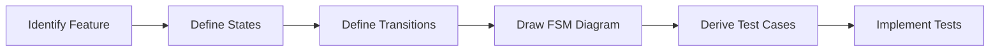
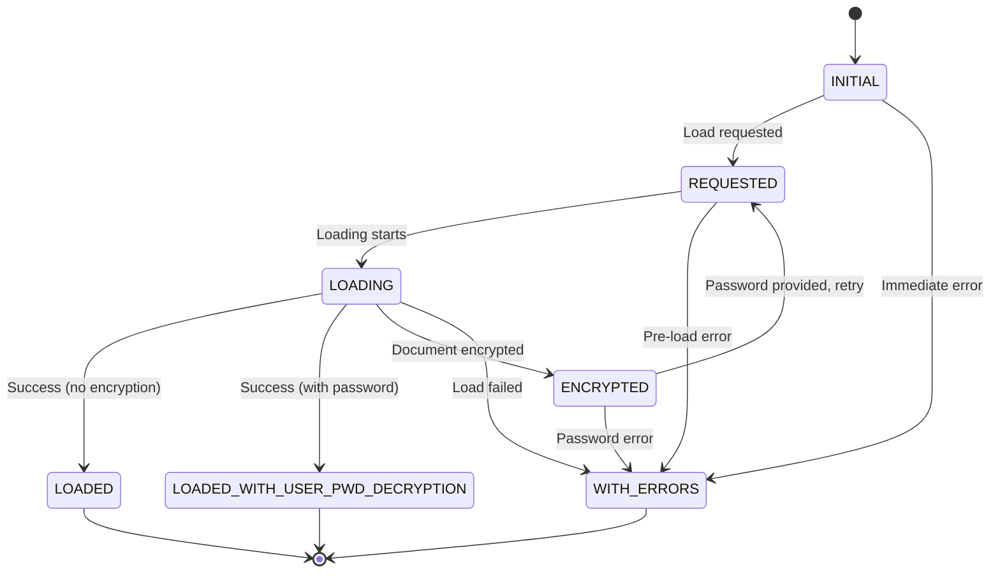
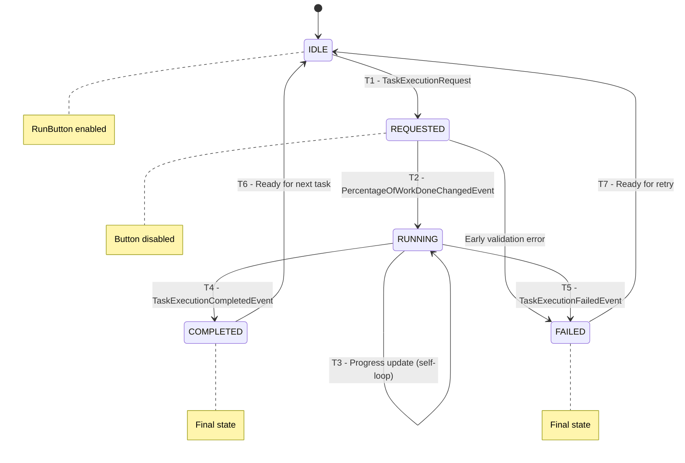

# SWE 261P Software Testing and Analysis - Part 2 Report
## PDFsam Basic: Finite State Machine Testing


<p align="left">
  
  
  
</p>

**Repo Github Link:**
https://github.com/eric-song-dev/pdfsam

**Team Members:** 
* Kingson Zhang: kxzhang@uci.edu
* Zian Xu: zianx11@uci.edu
* Zhenyu Song: zhenyus4@uci.edu

This report documents the systematic Finite State Machine (FSM) testing process of **PDFsam Basic**, covering three distinct features modeled as FSMs.

<div style="page-break-after: always;"></div>

## 📂 Quick Navigation
[TOC]

<div style="page-break-after: always;"></div>

## 🎯 1. Finite Models in Testing

### 1.1 What Are Finite Models?

**Finite models** are abstract representations of software behavior using a finite number of states and transitions. They allow testers to:

1. **Model complex behavior simply**: Reduce infinite input spaces to manageable state spaces
2. **Visualize system behavior**: Communicate expected behavior through diagrams
3. **Derive test cases systematically**: Generate tests that cover all states and transitions

### 1.2 Why Finite Models Are Useful for Testing

Finite models, particularly **Finite State Machines (FSMs)**, provide several key benefits:

| Benefit | Description |
|---------|-------------|
| **Systematic Coverage** | Ensure all states and transitions are tested |
| **Defect Detection** | Identify missing transitions and invalid state combinations |
| **Documentation** | Serve as executable specifications |
| **Regression Testing** | Provide baseline for detecting behavioral changes |

### 1.3 FSM Testing Coverage Criteria

Common FSM coverage criteria include:

- **State Coverage**: Visit every state at least once
- **Transition Coverage**: Execute every transition at least once
- **Path Coverage**: Test all possible paths (often impractical)
- **Transition Pair Coverage**: Cover all pairs of adjacent transitions

### 1.4 FSM Testing Process



<div style="page-break-after: always;"></div>

## 2. Kingson's FSM: PDF Document Loading Status

### 2.1 Feature Description

We selected the **`PdfDescriptorLoadingStatus`** enum, which models the lifecycle of PDF document loading in PDFsam.

| Property | Value |
|----------|-------|
| **Location** | [PdfDescriptorLoadingStatus.java](pdfsam-model/src/main/java/org/pdfsam/model/pdf/PdfDescriptorLoadingStatus.java) |
| **Type** | Java Enum with FSM semantics |
| **Used By** | `PdfDocumentDescriptor`, `LoadingStatusIndicatorUpdater`, `SelectionTable` |

This component is ideal for FSM modeling because:

1. **Explicit State Machine Implementation**: The enum defines states with a `validNext` set controlling transitions
2. **Transition Validation**: Built-in `canMoveTo()` and `moveTo()` methods enforce valid transitions
3. **Terminal State Detection**: `isFinal()` method identifies states with no outgoing transitions

### 2.2 FSM Diagram



### 2.3 State Descriptions

| State | Icon | Description | Terminal? |
|-------|------|-------------|-----------|
| **INITIAL** | - | Document just added, no load attempted | No |
| **REQUESTED** | 🕐 | Load request submitted | No |
| **LOADING** | ▶ | Actively loading document | No |
| **LOADED** | - | Successfully loaded, no password needed | **Yes** |
| **LOADED_WITH_USER_PWD_DECRYPTION** | 🔓 | Successfully loaded with user password | **Yes** |
| **ENCRYPTED** | 🔒 | Document is encrypted, password required | No |
| **WITH_ERRORS** | ⚠️ | Error occurred during loading | **Yes** |

### 2.4 Transition Table

| From \ To | INITIAL | REQUESTED | LOADING | LOADED | LOADED_PWD | ENCRYPTED | WITH_ERRORS |
|-----------|:-------:|:---------:|:-------:|:------:|:----------:|:---------:|:-----------:|
| **INITIAL** | - | ✓ | - | - | - | - | ✓ |
| **REQUESTED** | - | - | ✓ | - | - | - | ✓ |
| **LOADING** | - | - | - | ✓ | ✓ | ✓ | ✓ |
| **ENCRYPTED** | - | ✓ | - | - | - | - | ✓ |
| **LOADED** | - | - | - | - | - | - | - |
| **LOADED_PWD** | - | - | - | - | - | - | - |
| **WITH_ERRORS** | - | - | - | - | - | - | - |

### 2.5 Test Cases

#### Test File Location

| File | Location |
|------|----------|
| [PdfLoadingStatusFSMTest.java](pdfsam-model/src/test/java/org/pdfsam/model/pdf/PdfLoadingStatusFSMTest.java) | `pdfsam-model/src/test/java/org/pdfsam/model/pdf/` | 

#### Test Coverage Strategy
Test that all 7 states exist and have expected properties (icons, descriptions, styles).

#### Transition Coverage Tests
Test all 11 valid transitions:

| Test | From | To |
|------|------|----|
| `testInitialToRequested` | INITIAL | REQUESTED |
| `testInitialToWithErrors` | INITIAL | WITH_ERRORS |
| `testRequestedToLoading` | REQUESTED | LOADING |
| `testRequestedToWithErrors` | REQUESTED | WITH_ERRORS |
| `testLoadingToLoaded` | LOADING | LOADED |
| `testLoadingToLoadedWithPwd` | LOADING | LOADED_WITH_USER_PWD_DECRYPTION |
| `testLoadingToEncrypted` | LOADING | ENCRYPTED |
| `testLoadingToWithErrors` | LOADING | WITH_ERRORS |
| `testEncryptedToRequested` | ENCRYPTED | REQUESTED |
| `testEncryptedToWithErrors` | ENCRYPTED | WITH_ERRORS |

#### Invalid Transition Tests
Verify `IllegalStateException` is thrown for invalid transitions.

#### Terminal State Tests
Verify `isFinal()` returns true only for LOADED, LOADED_WITH_USER_PWD_DECRYPTION, and WITH_ERRORS.

#### Path Tests
Test complete loading paths as integration-style tests.

### 4.3 Running the Tests

```bash
# Build the project first
JAVA_HOME=$(/usr/libexec/java_home -v 21) mvn install -DskipTests

# Run FSM tests
JAVA_HOME=$(/usr/libexec/java_home -v 21) mvn test -pl pdfsam-model -Dtest=PdfLoadingStatusFSMTest
```

<div style="page-break-after: always;"></div>

## 3. Zian's FSM: Form Validation State

**Test File**: <a href="https://github.com/eric-song-dev/pdfsam/blob/master/pdfsam-ui-components/src/test/java/org/pdfsam/ui/components/support/ZianValidationStateFSMTest.java">pdfsam-ui-components/src/test/java/org/pdfsam/ui/components/support/ZianValidationStateFSMTest.java</a>

### 3.1 Feature Description

The **Validation State** system manages form field validation in PDFsam's UI. It tracks whether user input has been validated and the result of that validation.

**Location**: <a href="https://github.com/eric-song-dev/pdfsam/blob/master/pdfsam-ui-components/src/test/java/org/pdfsam/ui/components/support/FXValidationSupportTest.java">pdfsam-ui-components/src/test/java/org/pdfsam/ui/components/support/FXValidationSupportTest.java</a>

### 3.2 FSM Model Design

```java
public enum ValidationState {
NOT_VALIDATED(false),
VALID(false),     
INVALID(false);
    
    private Set<ValidationState> validDestinations;
    
    static {
        NOT_VALIDATED.validDestinations = Set.of(NOT_VALIDATED, VALID, INVALID);
        
        VALID.validDestinations = Set.of(VALID, INVALID, NOT_VALIDATED);
        
        INVALID.validDestinations = Set.of(INVALID, VALID, NOT_VALIDATED);
    }

    public boolean canMoveTo(ValidationState dest) { 
        return validDestinations.contains(dest); 
    }
}
```

Note: All states in this model are non-terminal (isFinal = false) because the UI validation process is inherently cyclic—users can continuously modify inputs and reset the state.

<div style="page-break-after: always;"></div>

### 3.3 FSM Diagram

<div align="center">
  
  <p><i>Figure 1: Hand-tuned State Transition Diagram for FXValidationSupport</i></p>
</div>

### 3.4 State Descriptions

| State | Description |
|-------|-------------|
| `NOT_VALIDATED` | Initial state, no validation performed yet |
| `VALID` | Input passed the current validator |
| `INVALID` | Input failed the current validator |

### 3.5 Transition Table

| ID    | From | To | Trigger |
|-------|------|-----|---------|
| T1    | NOT_VALIDATED | VALID | `validate()` with valid input |
| T2    | NOT_VALIDATED | INVALID | `validate()` with invalid input |
| T3    | VALID | INVALID | `validate()` with invalid input |
| T5,T7 | VALID | NOT_VALIDATED | `setValidator()` or `makeNotValidated()` |
| T4    | INVALID | VALID | `validate()` with valid input |
| T6,T8 | INVALID | NOT_VALIDATED | `setValidator()` or `makeNotValidated()` |

<div style="page-break-after: always;"></div>

### 3.6 Test Cases

**Test File**: <a href="https://github.com/eric-song-dev/pdfsam/blob/master/pdfsam-ui-components/src/test/java/org/pdfsam/ui/components/support/ZianValidationStateFSMTest.java">pdfsam-ui-components/src/test/java/org/pdfsam/ui/components/support/ZianValidationStateFSMTest.java</a>

#### Test Coverage Summary

| CATEGORY       | IDS     | SCOPE
|----------------|---------|-----------------------------------------
| State Coverage | S1-S3   | Initial, Valid, and Invalid states
| Transitions    | T1-T8   | All valid FSM edges including Reset
| Self-Loops     | L1-L4   | Event suppression (e.g., VALID -> VALID)
| Workflows      | W1-W4   | Full cycles and Validator changes
| Edge Cases     | E1-E3   | Null inputs and idempotent reset checks

#### Example Test Cases

**State Coverage Test:**
```java
@Test
@DisplayName("S1: NOT_VALIDATED state - initial state")
void testNotValidatedState() {
    assertEquals(ValidationState.NOT_VALIDATED,
            validator.validationStateProperty().get());
}
```

**Valid Transition Test:**
```java
@Test
@DisplayName("T1: NOT_VALIDATED -> VALID")
void testNotValidatedToValid() {
    ChangeListener<ValidationState> listener = mock(ChangeListener.class);
    validator.validationStateProperty().addListener(listener);
    validator.setValidator(Validators.nonBlank());

    validator.validate("valid input");

    verify(listener).changed(any(ObservableValue.class),
            eq(ValidationState.NOT_VALIDATED), eq(ValidationState.VALID));
    assertEquals(ValidationState.VALID,
            validator.validationStateProperty().get());
}
```

**Self-Loop Test:**
```java
@Test
@DisplayName("L1: VALID -> VALID (re-validate with valid input)")
void testValidToValid() {
    validator.setValidator(Validators.nonBlank());
    validator.validate("valid1");
    assertEquals(ValidationState.VALID, validator.validationStateProperty().get());

    ChangeListener<ValidationState> listener = mock(ChangeListener.class);
    validator.validationStateProperty().addListener(listener);

    validator.validate("valid2");

    // No state change should occur for self-loop
    verify(listener, never()).changed(any(), any(), any());
    assertEquals(ValidationState.VALID, validator.validationStateProperty().get());
}
```

**Complete Workflow Test:**
```java
@Test
@DisplayName("W1: Full validation cycle: NOT_VALIDATED -> VALID -> INVALID -> VALID")
void testFullValidationCycle() {
    validator.setValidator(Validators.nonBlank());

    // Initial state
    assertEquals(ValidationState.NOT_VALIDATED,
            validator.validationStateProperty().get());

    // First validation - valid
    validator.validate("valid");
    assertEquals(ValidationState.VALID,
            validator.validationStateProperty().get());

    // Re-validate - invalid
    validator.validate("");
    assertEquals(ValidationState.INVALID,
            validator.validationStateProperty().get());

    // Re-validate - valid again
    validator.validate("valid again");
    assertEquals(ValidationState.VALID,
            validator.validationStateProperty().get());
}
```

#### Test Results

```bash
$ mvn test -pl pdfsam-ui-components -Dtest=ZianValidationStateFSMTest                                                                                
...
[INFO] Results:
[INFO] 
[INFO] Tests run: 23, Failures: 0, Errors: 0, Skipped: 0
[INFO] 
[INFO] ------------------------------------------------------------------------
[INFO] BUILD SUCCESS
[INFO] ------------------------------------------------------------------------
[INFO] Total time:  9.638 s
[INFO] Finished at: 2026-02-09T12:03:50-08:00
[INFO] ------------------------------------------------------------------------```
```

<div style="page-break-after: always;"></div>

## 4. Zhenyu's FSM: Footer Task Execution UI

**Test File**: <a href="https://github.com/eric-song-dev/pdfsam/blob/master/pdfsam-ui-components/src/test/java/org/pdfsam/ui/components/tool/ZhenyuFooterFSMTest.java">pdfsam-ui-components/src/test/java/org/pdfsam/ui/components/tool/ZhenyuFooterFSMTest.java</a>

### 4.1 Feature Description

The **Footer Task Execution UI** manages the visual state of task execution in PDFsam's footer component. It tracks task progress from request to completion/failure through event-driven state transitions.

**Feature File**: <a href="https://github.com/eric-song-dev/pdfsam/blob/master/pdfsam-ui-components/src/main/java/org/pdfsam/ui/components/tool/Footer.java">pdfsam-ui-components/src/main/java/org/pdfsam/ui/components/tool/Footer.java</a>

### 4.2 FSM Model Design

This FSM is **explicitly modeled** using a custom enum with transition validation:

```java
public enum TaskExecutionState {
    IDLE(false),
    REQUESTED(false),
    RUNNING(false),
    COMPLETED(true),  // final state
    FAILED(true);     // final state

    static {
        IDLE.validDestinations = Set.of(REQUESTED);
        REQUESTED.validDestinations = Set.of(RUNNING, FAILED);
        RUNNING.validDestinations = Set.of(RUNNING, COMPLETED, FAILED);
        COMPLETED.validDestinations = Set.of(IDLE);
        FAILED.validDestinations = Set.of(IDLE);
    }

    public boolean canMoveTo(TaskExecutionState dest) { 
        return validDestinations.contains(dest); 
    }
}
```

This design allows the FSM to validate transitions programmatically and throw exceptions for invalid state changes.

<div style="page-break-after: always;"></div>

### 4.3 FSM Diagram



<div style="page-break-after: always;"></div>

### 4.4 State Descriptions

| State | Run Button | Final? | Description |
|-------|:----------:|:------:|-------------|
| `IDLE` | ✅ Enabled | No | Initial state, ready for new task |
| `REQUESTED` | ❌ Disabled | No | Task requested, waiting to start |
| `RUNNING` | ❌ Disabled | No | Task executing, progress updating |
| `COMPLETED` | ✅ Enabled | **Yes** | Task finished successfully |
| `FAILED` | ✅ Enabled | **Yes** | Task failed with error |

### 4.5 Transition Table

| ID | From | To | Trigger Event |
|:--:|------|-----|---------------|
| T1 | IDLE | REQUESTED | `TaskExecutionRequest` |
| T2 | REQUESTED | RUNNING | `PercentageOfWorkDoneChangedEvent` |
| T3 | RUNNING | RUNNING | `PercentageOfWorkDoneChangedEvent` (self-loop) |
| T4 | RUNNING | COMPLETED | `TaskExecutionCompletedEvent` |
| T5 | RUNNING | FAILED | `TaskExecutionFailedEvent` |
| T6 | COMPLETED | IDLE | Ready for next task |
| T7 | FAILED | IDLE | Ready for retry |

<div style="page-break-after: always;"></div>

### 4.6 Test Implementation

**Test File**: <a href="https://github.com/eric-song-dev/pdfsam/blob/master/pdfsam-ui-components/src/test/java/org/pdfsam/ui/components/tool/ZhenyuFooterFSMTest.java">pdfsam-ui-components/src/test/java/org/pdfsam/ui/components/tool/ZhenyuFooterFSMTest.java</a>

#### Test Coverage Summary

| Category | Tests | Description |
|----------|:-----:|-------------|
| **State Coverage** | 5 | IDLE, REQUESTED, RUNNING, COMPLETED, FAILED: Each state's properties and button behavior |
| **Transition Coverage** | 7 | T1-T7: All valid transitions including self-loop |
| **Invalid Transitions** | 7 | Verify invalid paths throw `IllegalStateException` |
| **Complete Paths** | 4 | Happy Path, Error Path, Early Error Path, Retry Path |
| **FSM Model Validation** | 2 | Verify model metadata (final states, transition counts) |

#### Example Test Cases

**State Coverage Test:**
```java
@Test
@DisplayName("COMPLETED: final, button re-enabled")
void completed() {
    fsm.moveTo(TaskExecutionState.REQUESTED);
    fsm.moveTo(TaskExecutionState.RUNNING);
    fsm.moveTo(TaskExecutionState.COMPLETED);
    eventStudio().broadcast(request("test"));
    eventStudio().broadcast(new TaskExecutionCompletedEvent(1000L, mockMetadata));

    assertEquals(TaskExecutionState.COMPLETED, fsm.getState());
    assertTrue(TaskExecutionState.COMPLETED.isFinal());
    assertFalse(runButton.isDisabled());
}
```

**Invalid Transition Test:**
```java
@Test
@DisplayName("IDLE → RUNNING (must go through REQUESTED)")
void idleToRunningInvalid() {
    assertFalse(TaskExecutionState.IDLE.canMoveTo(TaskExecutionState.RUNNING));
    assertThrows(IllegalStateException.class, () -> fsm.moveTo(TaskExecutionState.RUNNING));
}
```

**Self-Loop Test:**
```java
@Test
@DisplayName("RUNNING → RUNNING (self-loop)")
void runningToRunning() {
    fsm.moveTo(TaskExecutionState.REQUESTED);
    fsm.moveTo(TaskExecutionState.RUNNING);

    // Multiple progress updates - stays in RUNNING
    for (int pct : new int[] { 25, 50, 75, 100 }) {
        assertTrue(fsm.getState().canMoveTo(TaskExecutionState.RUNNING));
        fsm.moveTo(TaskExecutionState.RUNNING);
        assertEquals(TaskExecutionState.RUNNING, fsm.getState());

        var event = new PercentageOfWorkDoneChangedEvent(new BigDecimal(pct), mockMetadata);
        assertEquals(pct, event.getPercentage().intValue());
    }
}
```

**Complete Path Test:**
```java
@Test
@DisplayName("Happy Path: IDLE → REQUESTED → RUNNING → COMPLETED → IDLE")
void happyPath() {
    assertEquals(TaskExecutionState.IDLE, fsm.getState());

    fsm.moveTo(TaskExecutionState.REQUESTED);
    eventStudio().broadcast(request("merge"));
    assertTrue(runButton.isDisabled());

    fsm.moveTo(TaskExecutionState.RUNNING);
    fsm.moveTo(TaskExecutionState.COMPLETED);
    eventStudio().broadcast(new TaskExecutionCompletedEvent(2000L, mockMetadata));
    assertFalse(runButton.isDisabled());
    assertTrue(TaskExecutionState.COMPLETED.isFinal());

    fsm.moveTo(TaskExecutionState.IDLE);
    assertEquals(TaskExecutionState.IDLE, fsm.getState());
}
```

#### Test Results

```bash
$ mvn test -pl pdfsam-ui-components -Dtest=ZhenyuFooterFSMTest                                                                                
...
[INFO] Results:
[INFO]
[INFO] Tests run: 25, Failures: 0, Errors: 0, Skipped: 0
[INFO]
[INFO] ------------------------------------------------------------------------
[INFO] BUILD SUCCESS
[INFO] ------------------------------------------------------------------------
[INFO] Total time:  2.227 s
[INFO] Finished at: 2026-02-08T23:29:13-08:00
[INFO] ------------------------------------------------------------------------
```

<div style="page-break-after: always;"></div>

## 📋 5. Test Implementation Summary

### 5.1 New Test Files

| File | Location | Author |
|------|----------|--------|
|  | `pdfsam-model/src/test/java/org/pdfsam/model/pdf/` | Kingson Zhang |
| <a href="https://github.com/eric-song-dev/pdfsam/blob/master/pdfsam-ui-components/src/test/java/org/pdfsam/ui/components/support/ZianValidationStateFSMTest.java">ZianValidationStateFSMTest.java</a> | `pdfsam-ui-components/src/test/java/org/pdfsam/ui/components/support/` | Zian Xu |
| <a href="https://github.com/eric-song-dev/pdfsam/blob/master/pdfsam-ui-components/src/test/java/org/pdfsam/ui/components/tool/ZhenyuFooterFSMTest.java">ZhenyuFooterFSMTest.java</a> | `pdfsam-ui-components/src/test/java/org/pdfsam/ui/components/tool/` | Zhenyu Song |

### 5.2 Running the FSM Tests

```bash
# Run Kingson's PDF Loading Status FSM tests
mvn test -pl pdfsam-model -Dtest=KingsonPdfLoadingStatusFSMTest

# Run Zian's Validation State FSM tests
mvn test -pl pdfsam-ui-components -Dtest=ZianValidationStateFSMTest

# Run Zhenyu's Footer FSM tests
mvn test -pl pdfsam-ui-components -Dtest=ZhenyuFooterFSMTest

# Run all FSM tests together
mvn test -pl pdfsam-model,pdfsam-ui-components -Dtest="*FSMTest"
```

<div style="page-break-after: always;"></div>

## 🎯 6. Conclusion


### Key Takeaways

- FSM testing provides **systematic coverage** that random testing cannot guarantee
- State and transition coverage help identify **missing error handling** and **invalid state combinations**
- FSM diagrams serve as both **documentation** and **test case derivation source**

The FSM tests complement the **partition testing** from Part 1, providing a different perspective on the same codebase.

