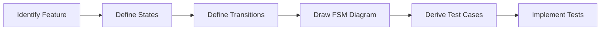
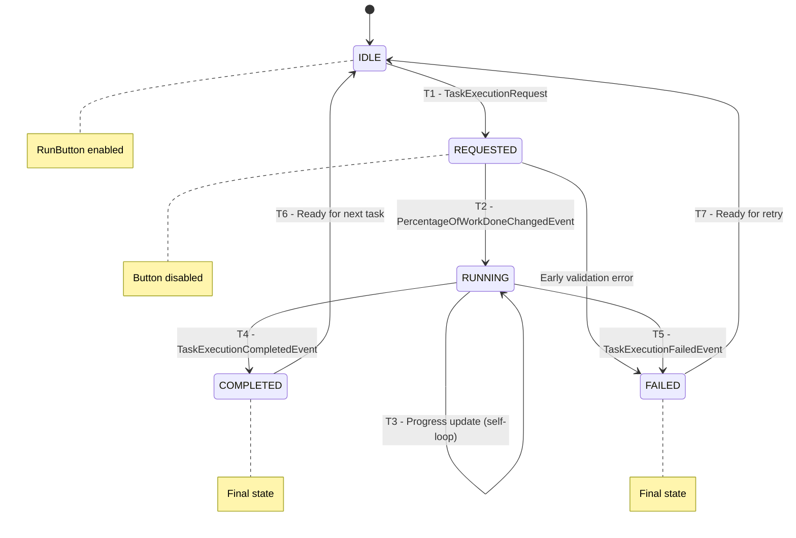

# SWE 261P Software Testing and Analysis - Part 2 Report
## PDFsam Basic: Finite State Machine Testing


<p align="left">
  
  
  
</p>

**Repo Github Link:**
https://github.com/eric-song-dev/pdfsam

**Team Members:** 
* Kingson Zhang: kxzhang@uci.edu
* Zian Xu: zianx11@uci.edu
* Zhenyu Song: zhenyus4@uci.edu

This report documents the systematic Finite State Machine (FSM) testing process of **PDFsam Basic**, covering three distinct features modeled as FSMs.

<div style="page-break-after: always;"></div>

## 📂 Quick Navigation
[TOC]

<div style="page-break-after: always;"></div>

## 🎯 1. Finite Models in Testing (10%)

### 1.1 What Are Finite Models?

**Finite models** are abstract representations of software behavior using a finite number of states and transitions. They allow testers to:

1. **Model complex behavior simply**: Reduce infinite input spaces to manageable state spaces
2. **Visualize system behavior**: Communicate expected behavior through diagrams
3. **Derive test cases systematically**: Generate tests that cover all states and transitions

### 1.2 Why Finite Models Are Useful for Testing

Finite models, particularly **Finite State Machines (FSMs)**, provide several key benefits:

| Benefit | Description |
|---------|-------------|
| **Systematic Coverage** | Ensure all states and transitions are tested |
| **Defect Detection** | Identify missing transitions and invalid state combinations |
| **Documentation** | Serve as executable specifications |
| **Regression Testing** | Provide baseline for detecting behavioral changes |

### 1.3 FSM Testing Coverage Criteria

Common FSM coverage criteria include:

- **State Coverage**: Visit every state at least once
- **Transition Coverage**: Execute every transition at least once
- **Path Coverage**: Test all possible paths (often impractical)
- **Transition Pair Coverage**: Cover all pairs of adjacent transitions

### 1.4 FSM Testing Process



<div style="page-break-after: always;"></div>

## 2. Kingson's FSM: PDF Document Loading Status

### 2.1 Feature Description


### 2.2 FSM Diagram


### 2.3 State Descriptions


### 2.4 Transition Table


### 2.5 Test Cases


<div style="page-break-after: always;"></div>

## 3. Zian's FSM: Form Validation State

### 3.1 Feature Description


### 3.2 FSM Diagram


### 3.3 State Descriptions


### 3.4 Transition Table


### 3.5 Test Cases


<div style="page-break-after: always;"></div>

## 4. Zhenyu's FSM: Footer Task Execution UI

### 4.1 Feature Description

The **Footer Task Execution UI** manages the visual state of task execution in PDFsam's footer component. It tracks task progress from request to completion/failure through event-driven state transitions.

**Location**: `pdfsam-ui-components/src/main/java/org/pdfsam/ui/components/tool/Footer.java`

### 4.2 FSM Model Design

This FSM is **explicitly modeled** using a custom enum with transition validation:

```java
public enum TaskExecutionState {
    IDLE(false),
    REQUESTED(false),
    RUNNING(false),
    COMPLETED(true),  // final state
    FAILED(true);     // final state

    static {
        IDLE.validDestinations = Set.of(REQUESTED);
        REQUESTED.validDestinations = Set.of(RUNNING, FAILED);
        RUNNING.validDestinations = Set.of(RUNNING, COMPLETED, FAILED);
        COMPLETED.validDestinations = Set.of(IDLE);
        FAILED.validDestinations = Set.of(IDLE);
    }

    public boolean canMoveTo(TaskExecutionState dest) { 
        return validDestinations.contains(dest); 
    }
}
```

This design allows the FSM to validate transitions programmatically and throw exceptions for invalid state changes.

### 4.3 FSM Diagram



### 4.4 State Descriptions

| State | Run Button | Final? | Description |
|-------|:----------:|:------:|-------------|
| `IDLE` | ✅ Enabled | No | Initial state, ready for new task |
| `REQUESTED` | ❌ Disabled | No | Task requested, waiting to start |
| `RUNNING` | ❌ Disabled | No | Task executing, progress updating |
| `COMPLETED` | ✅ Enabled | **Yes** | Task finished successfully |
| `FAILED` | ✅ Enabled | **Yes** | Task failed with error |

### 4.5 Transition Table

| ID | From | To | Trigger Event |
|:--:|------|-----|---------------|
| T1 | IDLE | REQUESTED | `TaskExecutionRequest` |
| T2 | REQUESTED | RUNNING | `PercentageOfWorkDoneChangedEvent` |
| T3 | RUNNING | RUNNING | `PercentageOfWorkDoneChangedEvent` (self-loop) |
| T4 | RUNNING | COMPLETED | `TaskExecutionCompletedEvent` |
| T5 | RUNNING | FAILED | `TaskExecutionFailedEvent` |
| T6 | COMPLETED | IDLE | Ready for next task |
| T7 | FAILED | IDLE | Ready for retry |

### 4.6 Test Implementation

**Test File**: `pdfsam-ui-components/src/test/java/org/pdfsam/ui/components/tool/ZhenyuFooterFSMTest.java`

#### Test Coverage Summary

| Category | Tests | Description |
|----------|:-----:|-------------|
| **State Coverage** | 5 | IDLE, REQUESTED, RUNNING, COMPLETED, FAILED: Each state's properties and button behavior |
| **Transition Coverage** | 7 | T1-T7: All valid transitions including self-loop |
| **Invalid Transitions** | 7 | Verify invalid paths throw `IllegalStateException` |
| **Complete Paths** | 4 | Happy Path, Error Path, Early Error Path, Retry Path |
| **FSM Model Validation** | 2 | Verify model metadata (final states, transition counts) |

#### Example Test Cases

**State Coverage Test:**
```java
@Test
@DisplayName("COMPLETED: final, button re-enabled")
void completed() {
    fsm.moveTo(TaskExecutionState.REQUESTED);
    fsm.moveTo(TaskExecutionState.RUNNING);
    fsm.moveTo(TaskExecutionState.COMPLETED);
    eventStudio().broadcast(request("test"));
    eventStudio().broadcast(new TaskExecutionCompletedEvent(1000L, mockMetadata));

    assertEquals(TaskExecutionState.COMPLETED, fsm.getState());
    assertTrue(TaskExecutionState.COMPLETED.isFinal());
    assertFalse(runButton.isDisabled());
}
```

**Invalid Transition Test:**
```java
@Test
@DisplayName("IDLE → RUNNING (must go through REQUESTED)")
void idleToRunningInvalid() {
    assertFalse(TaskExecutionState.IDLE.canMoveTo(TaskExecutionState.RUNNING));
    assertThrows(IllegalStateException.class, () -> fsm.moveTo(TaskExecutionState.RUNNING));
}
```

**Self-Loop Test:**
```java
@Test
@DisplayName("RUNNING → RUNNING (self-loop)")
void runningToRunning() {
    fsm.moveTo(TaskExecutionState.REQUESTED);
    fsm.moveTo(TaskExecutionState.RUNNING);

    // Multiple progress updates - stays in RUNNING
    for (int pct : new int[] { 25, 50, 75, 100 }) {
        assertTrue(fsm.getState().canMoveTo(TaskExecutionState.RUNNING));
        fsm.moveTo(TaskExecutionState.RUNNING);
        assertEquals(TaskExecutionState.RUNNING, fsm.getState());

        var event = new PercentageOfWorkDoneChangedEvent(new BigDecimal(pct), mockMetadata);
        assertEquals(pct, event.getPercentage().intValue());
    }
}
```

**Complete Path Test:**
```java
@Test
@DisplayName("Happy Path: IDLE → REQUESTED → RUNNING → COMPLETED → IDLE")
void happyPath() {
    assertEquals(TaskExecutionState.IDLE, fsm.getState());

    fsm.moveTo(TaskExecutionState.REQUESTED);
    eventStudio().broadcast(request("merge"));
    assertTrue(runButton.isDisabled());

    fsm.moveTo(TaskExecutionState.RUNNING);
    fsm.moveTo(TaskExecutionState.COMPLETED);
    eventStudio().broadcast(new TaskExecutionCompletedEvent(2000L, mockMetadata));
    assertFalse(runButton.isDisabled());
    assertTrue(TaskExecutionState.COMPLETED.isFinal());

    fsm.moveTo(TaskExecutionState.IDLE);
    assertEquals(TaskExecutionState.IDLE, fsm.getState());
}
```

#### Test Results

```bash
$ mvn test -pl pdfsam-ui-components -Dtest=ZhenyuFooterFSMTest                                                                                
[INFO] Scanning for projects...
[WARNING]
[WARNING] Some problems were encountered while building the effective model for org.pdfsam:pdfsam-basic:jar:5.4.5-SNAPSHOT
[WARNING] 'profiles.profile[win].plugins.plugin.(groupId:artifactId)' must be unique but found duplicate declaration of plugin org.codehaus.mojo:exec-maven-plugin @ line 259, column 14
[WARNING] 'profiles.profile[win].plugins.plugin.(groupId:artifactId)' must be unique but found duplicate declaration of plugin org.codehaus.mojo:exec-maven-plugin @ line 330, column 29
[WARNING] 'profiles.profile[mac].plugins.plugin.(groupId:artifactId)' must be unique but found duplicate declaration of plugin org.codehaus.mojo:exec-maven-plugin @ line 614, column 29
[WARNING]
[WARNING] It is highly recommended to fix these problems because they threaten the stability of your build.
[WARNING]
[WARNING] For this reason, future Maven versions might no longer support building such malformed projects.
[WARNING]
[INFO]
[INFO] ------------------< org.pdfsam:pdfsam-ui-components >-------------------
[INFO] Building PDFsam JavaFx components 5.4.5-SNAPSHOT
[INFO]   from pom.xml
[INFO] --------------------------------[ jar ]---------------------------------
[INFO]
[INFO] --- resources:3.4.0:resources (default-resources) @ pdfsam-ui-components ---
[INFO] skip non existing resourceDirectory /Users/ericsong/OpenSource/pdfsam/pdfsam-ui-components/src/main/resources
[INFO]
[INFO] --- compiler:3.14.1:compile (default-compile) @ pdfsam-ui-components ---
[INFO] Nothing to compile - all classes are up to date.
[INFO]
[INFO] --- resources:3.4.0:testResources (default-testResources) @ pdfsam-ui-components ---
[INFO] Copying 1 resource from src/test/resources to target/test-classes
[INFO]
[INFO] --- compiler:3.14.1:testCompile (default-testCompile) @ pdfsam-ui-components ---
[INFO] Nothing to compile - all classes are up to date.
[INFO]
[INFO] --- surefire:3.5.4:test (default-test) @ pdfsam-ui-components ---
[INFO] Using auto detected provider org.apache.maven.surefire.junitplatform.JUnitPlatformProvider
[INFO]
[INFO] -------------------------------------------------------
[INFO]  T E S T S
[INFO] -------------------------------------------------------
Initializing JavaFX thread
Feb 08, 2026 11:29:12 PM com.sun.javafx.application.PlatformImpl startup
WARNING: Unsupported JavaFX configuration: classes were loaded from 'unnamed module @20d3d15a'
JavaFX initialized
[INFO] Running Zhenyu's Footer FSM Test
[INFO] Running FSM Model Validation
Mockito is currently self-attaching to enable the inline-mock-maker. This will no longer work in future releases of the JDK. Please add Mockito as an agent to your build as described in Mockito's documentation: https://javadoc.io/doc/org.mockito/mockito-core/latest/org.mockito/org/mockito/Mockito.html#0.3
OpenJDK 64-Bit Server VM warning: Sharing is only supported for boot loader classes because bootstrap classpath has been appended
WARNING: A Java agent has been loaded dynamically (/Users/ericsong/.m2/repository/net/bytebuddy/byte-buddy-agent/1.17.7/byte-buddy-agent-1.17.7.jar)
WARNING: If a serviceability tool is in use, please run with -XX:+EnableDynamicAgentLoading to hide this warning
WARNING: If a serviceability tool is not in use, please run with -Djdk.instrument.traceUsage for more information
WARNING: Dynamic loading of agents will be disallowed by default in a future release
[INFO] Tests run: 2, Failures: 0, Errors: 0, Skipped: 0, Time elapsed: 0.624 s -- in FSM Model Validation
[INFO] Running Complete Paths
[INFO] Tests run: 4, Failures: 0, Errors: 0, Skipped: 0, Time elapsed: 0.018 s -- in Complete Paths
[INFO] Running Invalid Transitions
[INFO] Tests run: 7, Failures: 0, Errors: 0, Skipped: 0, Time elapsed: 0.033 s -- in Invalid Transitions
[INFO] Running Transition Coverage
[INFO] Tests run: 7, Failures: 0, Errors: 0, Skipped: 0, Time elapsed: 0.016 s -- in Transition Coverage
[INFO] Running State Coverage
[INFO] Tests run: 5, Failures: 0, Errors: 0, Skipped: 0, Time elapsed: 0.011 s -- in State Coverage
[INFO] Tests run: 0, Failures: 0, Errors: 0, Skipped: 0, Time elapsed: 0.715 s -- in Zhenyu's Footer FSM Test
[INFO]
[INFO] Results:
[INFO]
[INFO] Tests run: 25, Failures: 0, Errors: 0, Skipped: 0
[INFO]
[INFO] ------------------------------------------------------------------------
[INFO] BUILD SUCCESS
[INFO] ------------------------------------------------------------------------
[INFO] Total time:  2.227 s
[INFO] Finished at: 2026-02-08T23:29:13-08:00
[INFO] ------------------------------------------------------------------------
```

<div style="page-break-after: always;"></div>

## 📋 5. Test Implementation Summary

### 5.1 New Test Files

| File | Location | Author |
|------|----------|--------|
| `KingsonPdfLoadingStatusFSMTest.java` | `pdfsam-model/src/test/java/org/pdfsam/model/pdf/` | Kingson Zhang |
| `ZianValidationStateFSMTest.java` | `pdfsam-ui-components/src/test/java/org/pdfsam/ui/components/support/` | Zian Xu |
| `ZhenyuFooterFSMTest.java` | `pdfsam-ui-components/src/test/java/org/pdfsam/ui/components/tool/` | Zhenyu Song |

### 5.2 Running the FSM Tests

```bash
# Run Kingson's PDF Loading Status FSM tests
mvn test -pl pdfsam-model -Dtest=KingsonPdfLoadingStatusFSMTest

# Run Zian's Validation State FSM tests
mvn test -pl pdfsam-ui-components -Dtest=ZianValidationStateFSMTest

# Run Zhenyu's Footer FSM tests
mvn test -pl pdfsam-ui-components -Dtest=ZhenyuFooterFSMTest

# Run all FSM tests together
mvn test -pl pdfsam-model,pdfsam-ui-components -Dtest="*FSMTest"
```

<div style="page-break-after: always;"></div>

## 🎯 6. Conclusion


### Key Takeaways


